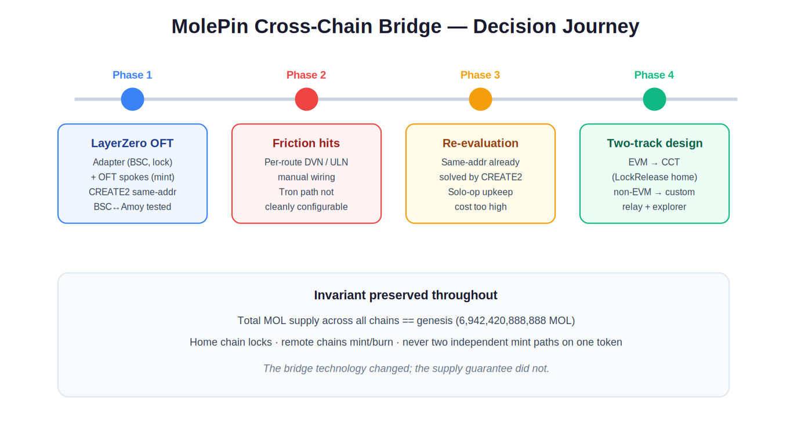
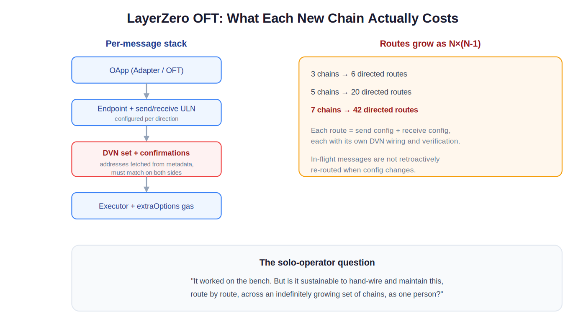
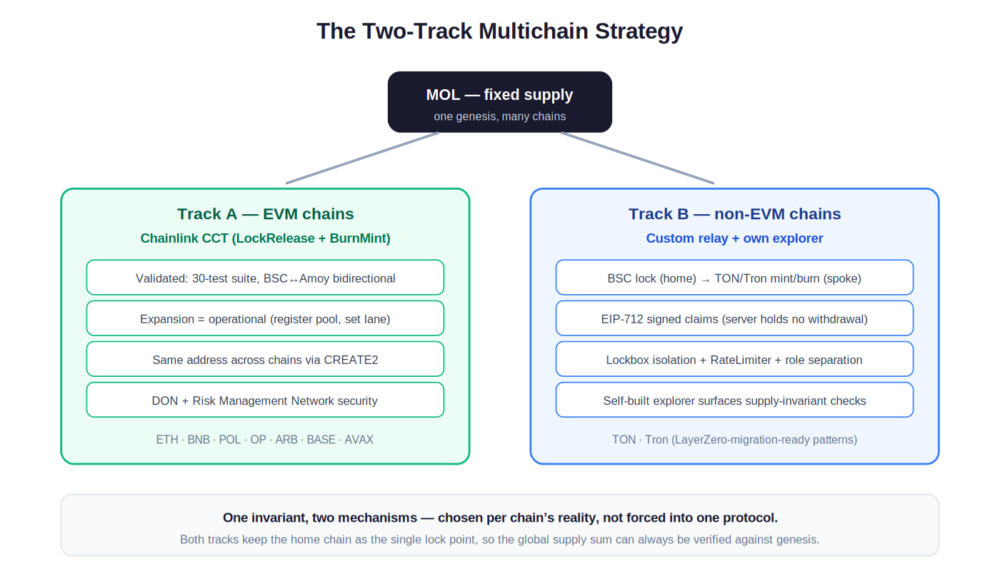
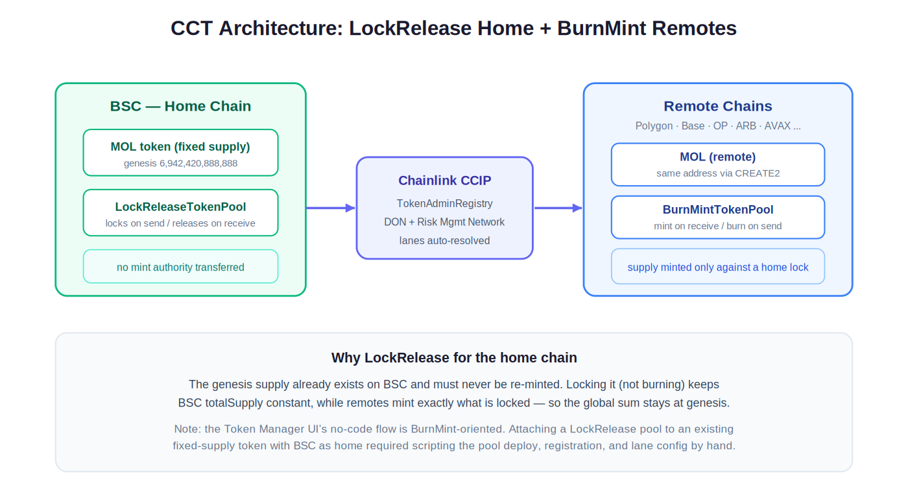

# ADR-0001 — EVM bridging: LayerZero OFT → Chainlink CCT, with a custom relay for non-EVM

| | |
|---|---|
| **Status** | Accepted |
| **Date** | 2026-06 |
| **Scope** | Cross-chain bridging for MOL (fixed-supply omnichain token) |
| **Supersedes** | The LayerZero OFT bridging approach (built, tested, retired) |
| **Decision owners** | MolePin (solo founder / CTO) |

> [!NOTE]
> This is an Architecture Decision Record. It documents *why* MolePin moved its EVM
> bridging from LayerZero OFT to Chainlink CCT, and why non-EVM chains (TON, Tron) use a
> separate custom relay. It is deliberately honest that the LayerZero path **worked** — the
> decision is a measured trade-off, not a bug report.



*Figure 1 — The decision journey: a working LayerZero build, friction discovered, re-evaluation, and the final two-track split. The supply guarantee is constant across all four phases.*

<details>
<summary><b>&gt;&gt; 한국어 요약 (click to expand)</b></summary>

<br>

이 문서는 MolePin의 EVM 브리지를 **LayerZero OFT → Chainlink CCT**로 전환한 이유와,
비-EVM 체인(TON·Tron)을 **별도 커스텀 릴레이**로 가져가는 이유를 기록한 의사결정 문서(ADR)입니다.

핵심 메시지는 "LayerZero가 실패해서 바꾼 게 아니다"라는 점입니다. LayerZero OFT 경로는
실제로 **구축·양방향 테스트까지 완료**되었습니다. 전환은 결함 때문이 아니라 **솔로 운영자 기준의
운영 지속가능성**이라는 측정된 트레이드오프 때문입니다.

- **EVM** → Chainlink CCT (BSC를 LockRelease home, 원격 체인은 BurnMint)
- **비-EVM** → 자체 릴레이 브리지 (EIP-712 서명 클레임 + 자체 탐색기)
- **불변식** → 모든 체인의 MOL 합 == genesis (6,942,420,888,888 MOL), 항상 검증 가능

</details>

---

## Context

MOL is a **fixed-supply** omnichain token: `6,942,420,888,888 MOL`, minted once at genesis,
never inflated or deflated. Every bridging decision is downstream of one rule:

> **The sum of MOL across all chains must always equal the genesis amount — and be verifiable on-chain.**

Design principles carried into every option:

- **Fixed-supply invariance** — global sum == genesis, always.
- **Token-pure, policy-in-gateway** — token contract minimal; bridge/fee logic in separate pools/gateways.
- **Native-gas fees** — fees paid in BNB/POL, never skimmed from MOL.
- **Validation-first** — test → deploy → verify; clean-slate redeploys over reusing tainted state.
- **Owner → multisig** — centralized owner now, multisig as the end state.

<details>
<summary><b>&gt;&gt; 한국어: 컨텍스트 (click to expand)</b></summary>

<br>

MOL은 **고정 공급** 토큰입니다 (`6,942,420,888,888 MOL`, genesis에서 1회 발행, 이후 증감 불가).
모든 브리지 결정은 다음 한 가지 규칙에서 파생됩니다:

> **모든 체인의 MOL 합은 항상 genesis와 같아야 하며, 온체인에서 검증 가능해야 한다.**

설계 원칙:
- **고정 공급 불변식** — 전역 합 == genesis
- **토큰-퓨어 / 정책은 게이트웨이** — 토큰 컨트랙트는 최소화
- **네이티브 가스 수수료** — BNB/POL로 지불, MOL에서 차감 안 함
- **검증 우선** — 테스트 → 배포 → 검증
- **owner → multisig** 전환 경로

</details>

---

## What was built on LayerZero (and tested)

The LayerZero approach was **not** a sketch. It reached a working, bidirectionally-tested state.

**Architecture (OFT adapter + native pattern):**

- **BSC (home):** `MolePinOFTAdapter` — wraps fixed-supply MOL and **locks** on outbound (lockbox). BSC `totalSupply` never changes.
- **Remotes:** `MolePinOFT` — mints on inbound, burns on outbound.
- **Same address everywhere:** remote OFTs deployed via the canonical CREATE2 factory + fixed salt → identical address across chains.

**Proof discipline (encoded in the actual test scripts):**

| Lesson | What broke | Fix |
|---|---|---|
| Live config as source of truth | Snapshot JSON had `eid: 0` for Amoy → routing silently broke | Read EIDs from live endpoints config, never the snapshot |
| Executor gas is mandatory | Empty `extraOptions` → destination `lzReceive` had no gas → message never executed | Generate a 200k-gas executor option with LZ utilities |
| ethers v6 read-only fee | `quoteSend` returns a read-only Result; reusing in `send` throws | Copy fee into a fresh object before `send` |
| Outbound blocklist | — | Dedicated test asserts a blocked address reverts in `_update` |

> [!IMPORTANT]
> **Same-address omnichain deployment was achieved with CREATE2 — not with anything LayerZero-specific.**
> This single fact is what later collapses LayerZero's cost/benefit for the EVM side.

<details>
<summary><b>&gt;&gt; 한국어: LayerZero로 실제 구축·검증한 것 (click to expand)</b></summary>

<br>

LayerZero 경로는 스케치가 아니라 **작동하는 양방향 테스트 완료** 상태까지 갔습니다.

- **BSC (home):** `MolePinOFTAdapter` — 고정공급 MOL을 wrap하고 outbound 시 **lock** (lockbox). BSC `totalSupply` 불변.
- **원격:** `MolePinOFT` — inbound mint / outbound burn.
- **동일 주소:** CREATE2 factory + 고정 salt → 모든 체인 동일 주소.

테스트 스크립트에 실제로 박힌 교훈:
- **라이브 config가 진실원천**: 스냅샷 JSON의 `eid: 0`(Amoy) 때문에 라우팅이 조용히 깨짐 → 라이브 config에서만 EID 읽기
- **executor 가스 필수**: 빈 `extraOptions` → 목적지 `lzReceive` 가스 없음 → 메시지 미실행 → 200k 가스 옵션 생성
- **ethers v6 read-only fee**: `quoteSend` 반환은 읽기전용 → 새 객체로 복사
- **outbound 차단 검증**: 차단 주소가 `_update`에서 revert하는지 전용 테스트

> **동일 주소는 CREATE2의 속성이지 LayerZero의 속성이 아니다** — 이 사실이 이후 EVM 쪽 LayerZero의 비용/편익을 무너뜨립니다.

</details>

---

## The friction (two separate problems)

### 1. Operational complexity scales as N×(N−1)

LayerZero v2's modular security (choose DVNs, confirmations, executor options **per direction, per lane**)
is genuinely powerful — and it is **work that multiplies**:

- Each directed route = a **send** config **and** a **receive** config.
- Each carries a **DVN set** whose addresses are fetched from metadata and must **match on both ends**.
- **In-flight messages are not retroactively re-routed** when config changes.



*Figure 2 — The per-message stack on the left; the combinatorics on the right. Directed routes grow as N×(N−1): 7 chains is already 42 routes, each needing its own send + receive + DVN wiring.*

| Chains | Directed routes | Each route needs |
|---:|---:|---|
| 3 | 6 | send + receive + DVN wiring |
| 5 | 20 | send + receive + DVN wiring |
| **7** | **42** | send + receive + DVN wiring |

For a funded team with an infra engineer, fine. For a **solo operator** also building the token,
gateways, TON layer, and app — hand-wiring and **maintaining** 42+ routes indefinitely is not sustainable.

### 2. The Tron path was not cleanly configurable (at the time)

This originally paused the LayerZero effort. But the record must be precise:

> [!WARNING]
> It would be **inaccurate** to write "LayerZero doesn't support TON/Tron."
> As of 2026 it does — TON integrated LayerZero (announced Feb 2025), and Tron is supported
> (including via USDT0's mesh). The accurate objection is **operating model, not capability**:
> even where LayerZero reaches a chain, per-route wiring + upkeep was the disqualifier for a solo operator.

<details>
<summary><b>&gt;&gt; 한국어: 마찰 지점 두 가지 (click to expand)</b></summary>

<br>

**1) 운영 복잡도가 N×(N−1)로 증가**
- 경로(방향)마다 **send + receive** config
- 각 config는 **DVN 세트**(메타데이터에서 주소 fetch, 양쪽 일치 필요)
- config 변경 시 **in-flight 메시지는 소급 재라우팅 안 됨**
- 7개 체인 = **42개 방향**. 솔로 운영자가 무한히 유지보수하기엔 지속 불가능.

**2) Tron 경로가 당시 깔끔하게 구성되지 않음** — 이게 원래 LayerZero를 중단시킨 계기.

> 단, "LayerZero가 TON/Tron을 지원하지 않는다"는 **부정확**합니다. 2026년 기준 둘 다 지원됩니다
> (TON 통합 2025년 2월 발표, Tron 지원). 정확한 반대 이유는 **능력**이 아니라 **운영 모델** —
> 경로별 수동 wiring과 유지보수 부담이 솔로 운영자에겐 실격 사유였다는 점입니다.

</details>

---

## Decision

### Re-evaluation: what was LayerZero actually buying?

| Benefit sought | LayerZero | Available another way? |
|---|---|---|
| Same contract address across chains | Yes (OFT deploy) | **Yes — CREATE2 + fixed salt** (bridge-independent) |
| No-liquidity mint/burn bridging | Yes (OFT) | **Yes — CCT BurnMintTokenPool** |
| Preserve a fixed home supply | Yes (adapter lock) | **Yes — CCT LockReleaseTokenPool** |
| Unified layer covering non-EVM | Yes (TON/Tron) | Needed a custom relay anyway for explorer control |
| Low solo-operator upkeep | **No — per-route wiring** | **Yes — CCT lanes auto-resolve via registry** |

Once same-address presence is recognized as a **CREATE2** property, LayerZero's unique contribution —
against its operational cost — is hard to justify for EVM.

### Adopted: a deliberate two-track strategy



*Figure 4 — One token, two bridging mechanisms chosen per chain reality. Both keep the home chain as the single lock point, so global supply can always be checked against genesis.*

**Track A — EVM via Chainlink CCT**

- **LockRelease** home (BSC) + **BurnMint** remotes.
- Lanes resolved through the CCIP registry (no per-route message config).
- CCTs are **token-logic-agnostic** — no CCIP code inherited into the token → fits *token-pure*.
- Same address via CREATE2 (GatewayV3, `configure()` separated).

**Track B — non-EVM via a purpose-built relay (TON, Tron)**

- **Lock-home, mint/burn-spoke** — BSC stays the single lock point (lockbox isolation).
- **EIP-712 signed claims** — server **holds no withdrawal rights**; it authorizes a claim, it cannot move funds.
- **RateLimiter + minter-role separation + supply consistency checks** on every path.
- **Self-hosted explorer** surfaces the supply invariant as a first-class feature (vs. depending on a third-party scan).
- **Migration-ready** — patterns chosen so a future LayerZero/other migration is a new-token + 1:1 migration, not a messaging rip-and-replace.

<details>
<summary><b>&gt;&gt; 한국어: 결정 (click to expand)</b></summary>

<br>

**재평가 — LayerZero가 실제로 사준 것은?**
- 동일 주소 = **CREATE2** 속성 (브리지 무관)
- 무유동성 mint/burn = **CCT BurnMint**
- 고정 home 공급 유지 = **CCT LockRelease**
- 솔로 운영 부담 낮음 = LayerZero는 ❌ / CCT는 레지스트리로 lane 자동 해결 ✅

→ 동일 주소가 CREATE2 속성임이 분명해지자, EVM 쪽에서 LayerZero의 고유 가치는 운영 비용 대비 정당화하기 어려워짐.

**채택 — 의도된 두 갈래 전략**

- **Track A (EVM) — Chainlink CCT**: BSC = LockRelease home, 원격 = BurnMint, lane은 레지스트리로 자동.
- **Track B (비-EVM) — 자체 릴레이 (TON·Tron)**: lock-home / mint-burn-spoke, EIP-712 서명 클레임(서버는 출금 권한 없음),
  RateLimiter + minter 역할 분리 + 공급 일치 검증, 자체 탐색기로 불변식 1급 노출, 향후 LayerZero 마이그레이션 대비 구조.

</details>

---

## The LockRelease detail (the part that required real engineering)

CCIP v1.5 ships a **Token Manager UI** with no-code guided deployment. In practice that flow is
oriented around the **BurnMint** case (a brand-new token minted across chains).

MolePin's case is the uncommon one: an **existing, fixed-supply** token that must keep its genesis
supply on BSC and attach a **LockRelease** pool with BSC as home. That did not complete cleanly via
the no-code UI, so it was **scripted by hand**:

```
deploy LockRelease pool
  → register admin via the token's owner()      (permissionless admin)
  → configure lanes
  → verify on-chain
```



*Figure 3 — BSC as a LockRelease home chain (genesis supply locked, never re-minted) with BurnMint remote pools. CCIP's registry resolves lanes; remotes mint only against a home-side lock, so the global sum holds at genesis.*

> [!NOTE]
> **CCT fully supports LockRelease pools — this is not a gap in the standard.**
> What needed hands-on work was driving a *LockRelease-home, fixed-supply* configuration to completion,
> because the no-code UI is BurnMint-centric. That is ordinary smart-contract engineering, and exactly
> the kind of step a token-pure, validation-first project expects to own.

**Why LockRelease on home, BurnMint on remotes:** the genesis supply already exists on BSC, so the home
chain must **lock** (not re-mint). BSC `totalSupply` stays constant; remotes mint exactly what is locked
and burn on the way back → the global sum holds at genesis.

<details>
<summary><b>&gt;&gt; 한국어: LockRelease 세부 — 실제 엔지니어링이 필요했던 지점 (click to expand)</b></summary>

<br>

CCIP v1.5의 **Token Manager UI**(no-code)는 사실상 **BurnMint** 시나리오(신규 토큰을 여러 체인에 발행) 중심입니다.

MolePin은 드문 케이스 — **기존 고정공급** 토큰을 BSC genesis 공급 유지한 채 BSC를 home으로 **LockRelease** 풀을 붙이는 구성.
이건 no-code UI로 완결되지 않아 **직접 스크립트로** 처리:

```
LockRelease 풀 배포
  → 토큰 owner() 로 admin 등록 (permissionless)
  → lane 설정
  → 온체인 검증
```

> **CCT는 LockRelease를 완전히 지원합니다 — 표준의 결함이 아닙니다.**
> 손이 필요했던 건 "LockRelease-home + 고정공급" 구성을 끝까지 끌고 가는 부분이며, no-code UI가
> BurnMint 중심이기 때문입니다. 이는 평범한 스마트컨트랙트 엔지니어링이고, 토큰-퓨어/검증-우선
> 프로젝트가 당연히 직접 소유할 단계입니다.

**왜 home=LockRelease / 원격=BurnMint인가:** genesis 공급이 이미 BSC에 존재하므로 home은 **lock**(재발행 X).
BSC `totalSupply` 불변, 원격은 lock된 만큼만 mint/burn → 전역 합이 genesis 유지.

</details>

---

## Validation reached (CCT baseline)

- ✅ **30-test suite** passing — MOL token, gateway units, bridge integration, remote behavior.
- ✅ **BSC↔Amoy bidirectional** transfers verified; supply invariant confirmed on-chain.
- ✅ **GatewayV3** CREATE2 same-address across chains (`configure()` separated).
- ✅ Adding a new EVM chain is now **operational, not a code change**: deploy pool → register → set lane.

---

## Consequences

**Positive**
- EVM expansion (ETH, BNB, POL, OP, ARB, BASE, AVAX) is a documented operational procedure.
- Token contract stays CCIP-agnostic (token-pure preserved).
- Supply invariant provable on both tracks; home chain is the single lock point.
- Self-hosted explorer gives a solo operator full visibility instead of third-party dependence.

**Negative / accepted trade-offs**
- **Dual-repo** (EVM contracts + TON contracts) is operationally inconvenient — accepted as worth CCT's advantages.
- Non-EVM relay is **custom code to maintain** — accepted, because the explorer/control benefit is wanted regardless.
- LockRelease-home setup needs **scripted deployment**, not the no-code UI — accepted as ordinary engineering.

> [!CAUTION]
> **Relay key handling.** The relay's signing path uses a fee-admin / master-wallet key.
> Signing keys are **never** committed in plaintext, **never** placed in a public repo, and the
> server is designed to authorize claims **without holding withdrawal rights**. Public excerpts
> describe structure and intent only.

<details>
<summary><b>&gt;&gt; 한국어: 결과 및 트레이드오프 (click to expand)</b></summary>

<br>

**긍정**
- EVM 확장(ETH·BNB·POL·OP·ARB·BASE·AVAX)은 문서화된 운영 절차로 처리.
- 토큰 컨트랙트는 CCIP 비의존(토큰-퓨어 유지).
- 두 트랙 모두 공급 불변식 증명 가능, home이 단일 lock 지점.
- 자체 탐색기로 솔로 운영자가 완전한 가시성 확보.

**감수한 트레이드오프**
- **듀얼 레포**(EVM + TON) 운영 불편 — CCT 장점 대비 감수.
- 비-EVM 릴레이는 **자체 유지보수 코드** — 탐색기/통제력 이점 때문에 감수.
- LockRelease-home 구성은 **스크립트 배포** 필요 — 평범한 엔지니어링으로 감수.

> **릴레이 키 관리.** 서명 경로는 fee-admin/master-wallet 키를 사용합니다. 서명 키는 **평문 커밋 금지**,
> **public repo 배치 금지**, 서버는 **출금 권한 없이** 클레임만 승인하도록 설계됩니다. 공개 발췌는 구조·의도만 기술합니다.

</details>

---

## Lessons

1. **"It worked once" ≠ "it's sustainable."** A bench-tested lane proves feasibility, not maintainability.
2. **Separate capability from operating model.** LayerZero *can* reach TON/Tron; the objection was per-route upkeep.
3. **Find the benefit's true source.** Same-address was a CREATE2 property, not a LayerZero one.
4. **UIs encode the common case.** CCT's no-code flow targets BurnMint; a fixed-supply LockRelease-home token is the uncommon case.
5. **Don't force one protocol across different chain realities.** EVM→CCT and non-EVM→custom-relay is more honest and more maintainable.
6. **Keep the invariant above the tooling.** Across LayerZero, CCT, and the relay, the home chain stays the single lock point and the global sum always equals genesis.

---

## Related documents

- [`CREATE2_SAME_ADDRESS.md`](../CREATE2_SAME_ADDRESS.md) — how identical cross-chain addresses are achieved.
- [`MIGRATION_CCT_TO_LZ.md`](../MIGRATION_CCT_TO_LZ.md) — migration-path notes.
- [`TESTNET_CHECKLIST.md`](../TESTNET_CHECKLIST.md) — testnet validation checklist.

---

<sub>MolePin (MOL) — building omnichain, one verifiable invariant at a time. This ADR is a living record; see commit history for revisions.</sub>
